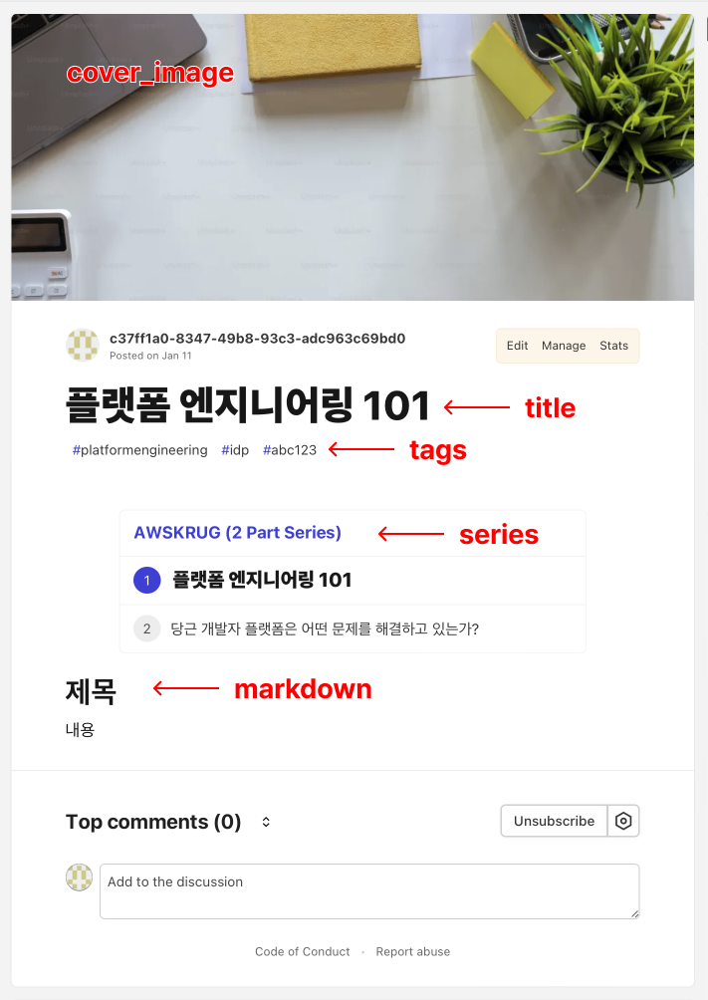
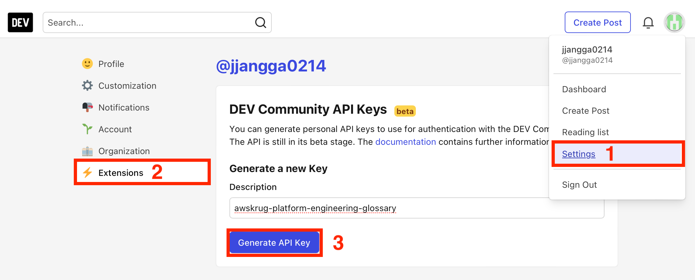
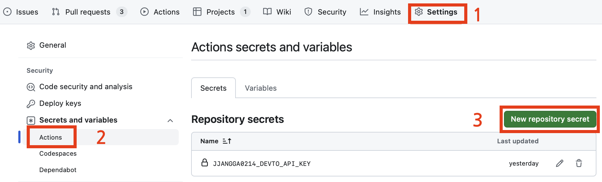
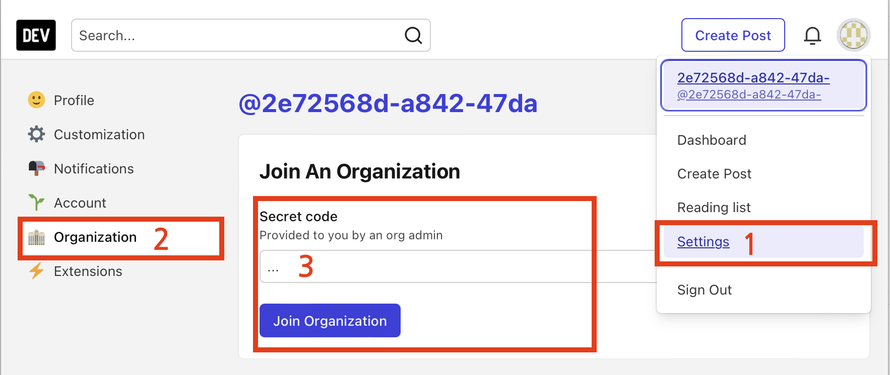

# Platform Engineering Glossary

## 용어집

Platform Engineering 과 관련된 정보를 번역하는데 사용되는 용어집입니다.

[glossary.csv](./glossary.csv) 를 참고해주세요.

## 용어집 사용 환경 세팅

정적인 용어집만으로 충분하다면 csv 파일을 바로 다운로드 받아도 됩니다.

반면에, 용어집을 동적으로 사용하고자 한다면 환경을 세팅해주세요.

```bash
# 최신 node.js(v14.19 / v16.9 이상) 가 설치된 환경이라면 corepack 을 활성화 할 수 있습니다.
# 단, 필수 사항은 아닙니다.
corepack enable

# pnpm 을 사전 설치한 적이 없어도 corepack 이 설치해 줍니다.
# corepack 활성화를 생략시 직접 pnpm 을 설치한 후 실행해야 합니다.
pnpm install
```

## 번역 아티클 작성 예시

alice 가 *`foo.md`*, *`bar.txt`* 를 작성하고, bob 이 *`qux.smi`* 를 작성하기로 했다고 가정해보겠습니다.

```
platform-engineering-glossary
├── articles
│   ├── alice
│   │   ├── foo.md
│   │   └── bar.txt
│   └── bob
│       └── qux.smi
└── glossary.csv
```

**glossary.csv**:

용어집은 아래와 같다고 전제해보겠습니다.

```csv
en,ko
Platform Engineering,플랫폼 엔지니어링
--- 이하 생략 ---
```

**articles/alice/foo.md**:

아티클은 [Mustache](https://mustache.github.io) spec 으로 templating 합니다.

```md
# {{ Platform Engineering }} 을 소개합니다.

{{ Platform Engineering }}에 대해 다루어볼까요?
```

다음 실행시,

```bash
pnpm render
```

아티클에 glossary 가 삽입되어 렌더링된 파일이 생성됩니다.

```diff
  platform-engineering-glossary
  ├── articles
  │   ├── alice
  │   │   ├── foo.md
+ │   │   ├── foo.rendered.md
  │   │   ├── bar.txt
+ │   │   └── bar.rendered.txt
  │   └── bob
  │       ├── qux.smi
+ │       └── qux.rendered.smi
  └── glossary.csv
```

**articles/alice/foo.rendered.md**:

```md
# 플랫폼 엔지니어링을 소개합니다.

플랫폼 엔지니어링에 대해 다루어볼까요?
```

참고로 *`*.rendered.*`* 파일은 gitignore 됩니다.

또는, 실시간으로 렌더링할 수도 있습니다.

```bash
pnpm dev
```

<https://github.com/awskrug/platform-engineering-glossary/assets/28584151/ad7deed3-5e06-4948-b495-73ea1c8259d6>

## 아티클 배포

[dev.to](https://dev.to) 기준으로 배포하는 방법을 설명합니다.

파일시스템의 구조는 앞서 설명한 렌더링 예시와 같습니다.<br/>
그 중, 마크다운 파일(*`articles/*/**.md`*)에 한해 배포가 이루어집니다.

우선, 마크다운 파일 상단의 `---` 와 `---` 사이에 다음과 같이 Frontmatter 를 작성할 수 있습니다.

```md
---
# Frontmatter 내(--- 안)에서는 "#" 이 코멘트 문자입니다.
# Frontmatter 밖(--- 밖)에서는 마크다운이므로 "#" 은 h1 입니다.

# 어떤 플랫폼(블로그 등)에 퍼블리시할지 지정합니다.
# 현재는 'dev.to' 만 지원합니다.
platform: dev.to

# 글의 제목입니다.
title: 내가 플랫폼에 대해 말할 때 짚는 것들

# UI 에서 시작적으로 보이지 않는 메타 정보로서의 설명문입니다.
description: {{ Platform Engineering }} 과 관련해 효과적인 디지털 플랫폼이 제공 규모를 확장하는 데 도움이 되는 이유, 플랫폼에 포함되어야 하는 내용, 플랫폼 구축을 시작하는 방법.

# comma-separated values 형식의 태그입니다.
# Lowercase 와 숫자만 지원합니다.
tags: platformengineering,platform

# 글의 커버이미지입니다.
# 100:42 비율로 맞추어져 보이게 됩니다.
cover_image: https://martinfowler.com/articles/talk-about-platforms/meta.png

# dev.to 의 포스트에는 비공식인 draft 모드와 공식적인 published 모드가 있습니다.
# 이 두 모드는 언제든 상호 전환가능합니다.
# published 가 false 면 전자, true 면 후자입니다.
published: true

# dev.to 에선 소속된 org 에 포스팅할 수도 있습니다.
# organization_id 가 Frontmatter 에 없다면 개인 포스팅이 되고,
# 존재한다면 org 로 포스팅됩니다.
# 8203 은 Platform Engineering Korea 의 id 입니다.
# 해당 org 의 주소는 https://dev.to/platform-engineering-korea 입니다.
organization_id: 8203

# CI 에서 해당 아티클을 배포하거나 검사(Frontmatter 린트)할지 여부입니다.
# main 에 push 되거나 PR 이 merge 되면 배포됩니다.
# 새로운 글이면 새로 퍼블리시되고,
# 수정된 글이면 수정내역이 반영됩니다.
ci: true

# URL 로 접근할 때의 slug 를 지정해줍니다.
# 예를 들면 아래의 slug 로 배포하면,
# https://dev.to/platform-engineering-korea/about-platforms-1s26
# 와 같은 주소가 생성됩니다.
# slug 는 처음 글을 퍼블리시하는 시점에만 정할 수 있습니다.
slug: about-platforms

# dev.to 는 여러 글을 하나의 시리즈로 묶는 기능을 제공합니다.
# 해당 글이 속할 시리즈의 이름입니다.
# 시리즈가 이미 존재하지 않으면 시리즈의 첫 글이 됩니다.
# 시리즈 네이밍은 띄어쓰기, 한글, 숫자 등 자유로이 가능합니다.
# 시리즈에 넣지 않을 글은 series 를 삭제(또는 주석처리)해 주세요.
series: AWSKRUG

# 퍼블리시된 글의 id 입니다.
# CI 에서 배포되었다면 post-publish 과정이
# id 를 Frontmatter 에 적어 commit 해 줍니다.
# 따라서 작성자가 직접 신경 쓸 필요는 없습니다.
id: 1732255

# 아래 부터는 Frontmatter 밖입니다.
# 따라서 markdown 으로 작성하시면 됩니다.
# 또한, templating({{ }}) 을 했는지 아닌지의 여부는 배포와 무관합니다.
# templating 된 경우, 렌더링 된 내용으로 배포됩니다.
---

# {{ Platform Engineering }} 을 소개합니다.

{{ Platform Engineering }}에 대해 다루어볼까요?
```

`organization_id` 와 `slug` 를 제외하면 퍼블리시 후라도 언제든 Frontmatter 의 수정으로 변경 반영이 가능합니다.

참고로 dev.to 는 트위터, 유튜브 등 임베딩(``)도 지원하고, 그 외에도 다양한 기능들은 [Editor Guide](https://dev.to/p/editor_guide) 에서 찾아볼 수 있습니다.

dev.to 에 배포한 예시는 다음과 같습니다.



배포가 이루어지려면 처음 dev.to 에서 API Key 를 발급받어야 합니다.



발급받은 API Key 를 GitHub Secret 에 등록해줍니다.



이어, 설정파일을 작성합니다.

**articles/config.yaml**:

```yaml
jjangga0214: # 파일시스템에서 articles/jjangga0214/** 에 대한 설정입니다.
  dev.to:
    # API Key 를 제공할 환경변수 이름입니다.
    apiKey: JJANGGA0214_DEVTO_API_KEY

alice:
  dev.to:
    apiKey: ALICE_DEVTO_API_KEY

bob:
  dev.to:
    apiKey: BOB_DEVTO_API_KEY

# ...
```

위 설정 파일에서 작성한 내용대로 GitHub Secret 을 환경변수로 제공해줍니다.

**.github/workflows/main.yaml**:

```yaml
- name: haetae publish
  # ...
  env:
    GITHUB_TOKEN: ${{ secrets.GITHUB_TOKEN }}
    JJANGGA0214_DEVTO_API_KEY: ${{ secrets.JJANGGA0214_DEVTO_API_KEY }}
    ALICE_DEVTO_API_KEY: ${{ secrets.ALICE_DEVTO_API_KEY }}
    BOB_DEVTO_API_KEY: ${{ secrets.BOB_DEVTO_API_KEY }}
    # ...
```

dev.to 의 org 에 배포하려면, 배포 전에 먼저 조인해야 합니다.
org 운영자에게 연락하여 Secret Code 를 받아 가입할 수 있습니다.
[Platform Engineering Korea](https://dev.to/platform-engineering-korea) 는 [@jjangga0214](https://github.com/jjangga0214) 가 관리하고 있습니다.


